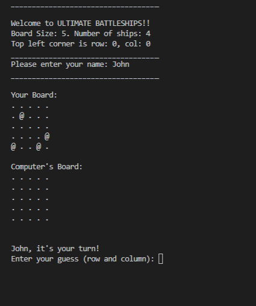

# ULTIMATE Battleships
Battleships, also known simply as Battleship, is a classic two-player strategy game that blends deduction, tactics, and a touch of luck. Originating as a pencil-and-paper game during World War I, it has since evolved into a popular board game, digital adaptation, and mobile app enjoyed by players of all ages worldwide.

## Game Overview

In Battleships, each player commands a fleet of ships strategically placed on a grid. The objective is to locate and "sink" the opponent’s fleet by guessing their ship positions through a series of targeted strikes. The game involves strategic thinking as players must conceal their ship placements while trying to discover their opponent’s.

## Why you should play the battleship game
Battleships is more than just a game—it's a test of strategy, anticipation, and patience. Its simplicity makes it accessible, while its depth keeps players coming back for more. Whether played on paper, a game board, or digitally, it remains an enduring favorite in family game nights and competitive play.

Are you ready to command your fleet and outmaneuver your opponent? Let the battle begin!

## Contents
1. [User Experience (UX)](#user-experience-ux)
    - [Initial Discussion](#initial-discussion)
    - [User Stories](#user-stories)
2. [Design](#design)
    - [Colour Scheme](#colour-scheme)
    - [Typography](#typography)
    - [Imagery](#imagery)
    - [Wireframes](#wireframes)
3. [Features](#features)
    - [Accessibility](#accessibility)
4. [Technologies Used](#technologies-used)
    - [Languages Used](#languages-used)
    - [Frameworks, Libraries & Programs Used](#frameworks-libraries-programs-used)
5. [Deployment & Local Development](#deployment-local-development)
    - [Deployment](#deployment)
    - [Local Development](#local-development)
        - [How to Fork](#how-to-fork)
        - [How to Clone](#how-to-clone)
6. [Testing](#testing)   
    - [Solved Bugs](#solved-bugs)
    - [Known Bugs](#known-bugs)
    - [Testing User Stories](#testing-user-stories)   
    - [Thank You Page](#thank-you-page)
    - [Full Testing](#full-testing)
7. [Credits](#credits)
    - [Code Used](#code-used)
    - [Content](#content)
    - [Media](#media)
    - [Acknowledgments](#acknowledgments)

---

## User Experience (UX)

### Initial Discussion
The Battleship Game is a text-based interactive experience where the player competes against a computer. The primary goal is to create an engaging yet straightforward gameplay experience while maintaining functionality and usability.

### User Stories
1. As a user, I want a clear and intuitive grid-based board for gameplay.
2. As a user, I want responsive feedback on my actions (e.g., hits and misses).
3. As a user, I want a seamless flow of turns and easy-to-understand instructions.
4. As a user, I want to track scores and understand the outcome of the game.

## Design

### Colour Scheme
Since this is a text-based game, the visual elements focus on ASCII characters. 
- Symbols like `.` for empty spaces, `@` for ships, `X` for hits, and `O` for misses provide clarity.

### Typography
- Monospaced fonts are ideal for aligning the grid structure.

### Imagery
- No images are used; ASCII characters ensure cross-platform compatibility.

### Wireframes
- Text-based representation of the game board and turn prompts.

## Features

## Key Features
1. Strategic Placement: Players must carefully position their ships to maximize defense while minimizing predictability.
2. Deductive Reasoning: Every missed or successful shot brings new information, challenging players to think critically and outwit their opponent.
3. Simple Yet Engaging: The rules are straightforward, but the gameplay offers endless strategic depth and replayability.

### Accessibility
- Keyboard-only interaction ensures the game is accessible for users with visual impairments when paired with screen readers.
- Clear and concise text-based instructions.

## Technologies Used

### Languages Used
- Python

### Frameworks, Libraries & Programs Used
1. Python Standard Library
2. Heroku for deployment to the server.
3. PEP8 Python Validator for Python Code Validation.

## Deployment & Local Development

### Deployment
- As a text-based Python script, the game can be run directly in any Python environment.

### Local Development

#### How to Fork
1. Navigate to the repository on GitHub.
2. Click on the "Fork" button to create a copy in your account.

#### How to Clone
1. Copy the repository URL.
2. Run `git clone <repository-url>` in your terminal.

## Testing

### Solved Bugs
- Resolved issues with ship placement validation.
- Fixed an infinite loop in random guess generation.

### Known Bugs
- Rare edge cases where the computer might repeat guesses.

### Testing User Stories
- Verified intuitive gameplay and clear turn prompts.
- Ensured accurate score tracking and endgame conditions.

### Thank You Page
- Thank you Code Institute technical staff for tutoring, mentoring, and student care.

### Full Testing
- Conducted playthroughs to confirm all functionalities, including edge cases and invalid inputs.

## Credits
- Code Institute Portfolio 3: Project Submission lesson  for using the set-up code for the Ultimate Battleship game.

### Code Used
- Random number generation and validation logic for ship placement were inspired by standard Python documentation.

### Content
- Game rules based on the classic Battleship board game.

### Media
- No media used.

### Acknowledgments
- Special thanks to Code Institute for giving me the opportunity to learn as a full stack software development.
